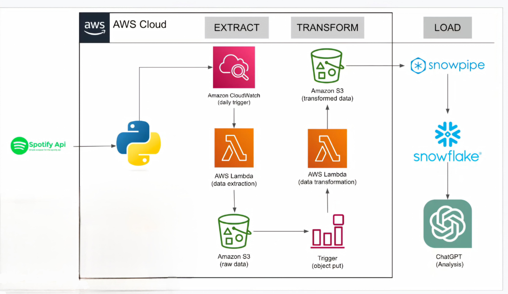

# Spotify_DE_Project : Spotify Global Trending Songs ETL Pipeline

## Introduction
This project involves building an ETL (Extract, Transform, Load) pipeline to fetch Spotify global trending songs using Spotify APIs. The pipeline leverages various AWS services and Snowflake for efficient data extraction, transformation, and loading.

## Architecture Diagram

## Technology Used
- **Programming Language:** Python
- **Cloud Services:** AWS (Lambda, S3)
- **Data Warehousing:** Snowflake
- **Integration Tools:** Snowpipe
